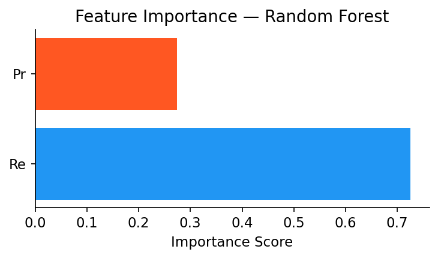
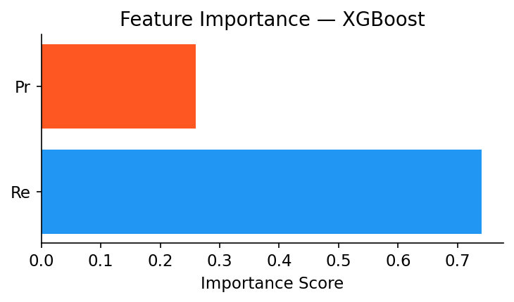
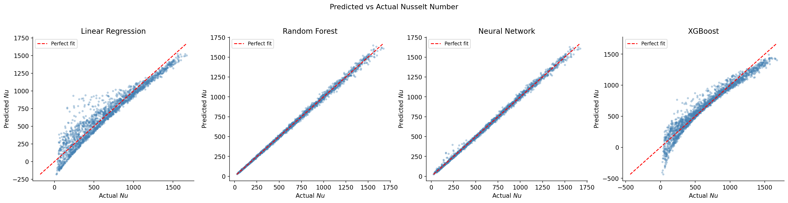

# Machine-Learning-Based Prediction of the Nusselt Number in Turbulent Pipe Flow


## Overview

This project investigates the capability of Machine Learning (ML) models to predict the **Nusselt number (Nu)** using high-fidelity data points extracted from the study: **"Simple heat transfer correlations for turbulent tube flow"** by Dawid Taler and Jan Taler.

The core objective is to evaluate if modern regression architectures can accurately capture the non-linear heat transfer characteristics across a wide range of flow regimes without relying on simplified classical empirical equations.

### Core Question
> Can ML models learn the complex relationship of $Nu = f(Re, Pr)$ directly from experimental datasets?

---

## Physics Background & Dataset

The dataset is derived from the research by **Taler & Taler**, covering a broad spectrum of fluid properties and flow conditions. Unlike older models, these correlations are designed for high precision across transition and turbulent regimes.

| Parameter | Symbol | Range |
|-----------|--------|-------|
| **Reynolds Number** | $Re$ | $3 \cdot 10^3$ to $10^6$ |
| **Prandtl Number** | $Pr$ | $0.1$ to $10^3$ |
| **Nusselt Number** | $Nu$ | Target Variable |

## Data Source

Taler, D., & Taler, J. *Simple heat transfer correlations for turbulent tube flow*, Cracow University of Technology (2017).

PDF: https://www.e3s-conferences.org/articles/e3sconf/pdf/2017/01/e3sconf_wtiue2017_02008.pdf

---

## Models Evaluated

The study implements and compares four distinct regression architectures:

1.  **Linear Regression:** Baseline model to check for linear separability.
2.  **Random Forest (Ensemble):** To capture non-linearities and handle feature interactions.
3.  **XGBoost (Gradient Boosting):** High-performance tree boosting for tabular data.
4.  **Neural Network (MLP):** A Multi-Layer Perceptron to model the underlying physics via backpropagation.

---

## Results


| Model | RMSE | MAE | R² |
| :--- | :---: | :---: | :---: |
| **Random Forest** | **17.5009** | **11.9222** | **0.9980** |
| **Neural Network** | 18.5966 | 12.6691 | 0.9978 |
| **XGBoost** | 95.7353 | 69.1699 | 0.9409 |
| **Linear Regression** | 108.2712 | 79.6539 | 0.9244 |

### Key Findings
*   **Dominant Model:** Random Forest outperformed all other models with an **R² of 0.998**, suggesting an almost perfect capture of the Taler correlations.
*   **Non-Linearity:** The significant performance gap between Random Forest and Linear Regression confirms the high degree of non-linearity in the $Nu$ relationship.

---

## Feature Importance Analysis

Which physics parameter drives the heat transfer most? Our ML models reveal the contribution of each dimensionless number:

| Feature | Importance (Random Forest) | Importance (XGBoost) |
| :--- | :---: | :---: |
| **Reynolds Number ($Re$)** | **72.55%** | **74.07%** |
| **Prandtl Number ($Pr$)** | 27.45% | 25.93% |
<p align="center">
<p align="center">
  
  
</p>

*Insight: As expected by fluid dynamics theory, the flow regime (Re) has approximately 2.7x more influence on the heat transfer coefficient than the fluid property (Pr).*

---   
## Model Performance Comparison

The following figure presents a comparison between actual and predicted Nusselt number (Nu) values using different machine learning models.

<p align="center">
  
</p>

### Models Evaluated
- Linear Regression  
- Random Forest  
- Neural Network  
- XGBoost  

### Key Insight
Tree-based models and neural networks show higher accuracy and better alignment with the ideal prediction line compared to linear regression.

## Installation
```bash
git clone https://github.com/YOUR_USERNAME/nusselt-ml.git
cd nusselt-ml
pip install -r requirements.txt
```

