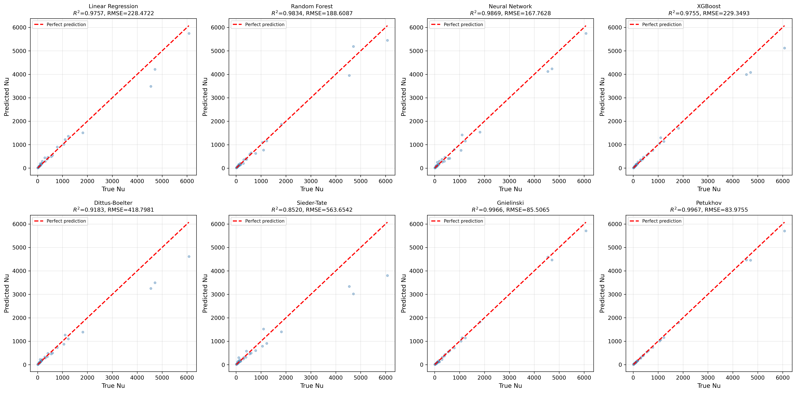

# 🔥 Nusselt Number Prediction Using Machine Learning and Empirical Correlations


---

## 📌 Overview

Predicting the **Nusselt number (Nu)** is a fundamental task in convective heat transfer analysis, particularly for turbulent pipe flows.

Traditionally, engineers rely on **empirical correlations** derived from experimental studies.  
In this project, we investigate whether **Machine Learning (ML)** models can match or outperform classical correlations.

This repository provides a **complete experimental pipeline**, including:

- Data preprocessing and log transformation
- Training multiple ML regression models
- 5-fold cross-validation
- Overfitting analysis
- Implementation of classical empirical correlations
- Comprehensive ML vs empirical comparison
- Automated visualization and reporting

---

# 📊 Dataset

The dataset contains:

- Reynolds number (**Re**)
- Prandtl number (**Pr**)
- Nusselt number (**Nu**)

### Dataset Summary

- Total samples: **66**
- Features: Re, Pr
- Target: Nu

### Variable Ranges

Reynolds number:
3000 ≤ Re ≤ 1,000,000  

Prandtl number:
0.1 ≤ Pr ≤ 1000  

Nusselt number:
7.86 ≤ Nu ≤ 31,968  

---

## 🔄 Preprocessing

Because of the wide dynamic range of variables, we applied:

- `log10(Re)`
- `log10(Pr)`
- `log10(Nu)`

Then standardized features using:

Train/Test split:

- 80% Training
- 20% Testing
- Random seed = 42

---

# 🤖 Machine Learning Models

The following regression models were evaluated:

1. Linear Regression  
2. Random Forest  
3. Neural Network (MLPRegressor)  
4. XGBoost  

### ✅ Hold-out Test Results (log scale)

| Model | R² | RMSE | MAE |
|-------|------|------|------|
| Random Forest | 0.9897 | 0.0720 | 0.0553 |
| XGBoost | 0.9891 | 0.0738 | 0.0543 |
| Linear Regression | 0.9853 | 0.0860 | 0.0633 |
| Neural Network | 0.9705 | 0.1217 | 0.0965 |

Best ML model (test set): **Random Forest**

---

## 🔁 5-Fold Cross Validation

All models passed the overfitting check.

Gap between CV R² and Hold-out R² < 0.05  
✅ No significant overfitting detected.

---

# 📘 Empirical Heat Transfer Correlations

The following classical turbulent pipe flow correlations were implemented:

1. Dittus–Boelter  
2. Sieder–Tate  
3. Gnielinski  
4. Petukhov  

### ✅ Empirical Results (Original Scale)

| Correlation | R² | RMSE | MAE |
|-------------|------|------|------|
| Petukhov | 0.9967 | 83.98 | 34.33 |
| Gnielinski | 0.9966 | 85.51 | 41.03 |
| Dittus–Boelter | 0.9183 | 418.80 | 174.53 |
| Sieder–Tate | 0.8520 | 563.65 | 243.72 |

Best empirical correlation: **Petukhov**

---

# 🏆 Final Comparison (ML vs Empirical)

| Model | Type | R² |
|--------|--------|--------|
| Petukhov | Empirical | **0.9967** |
| Gnielinski | Empirical | 0.9966 |
| Neural Network | ML | 0.9869 |
| Random Forest | ML | 0.9834 |

## ✅ Overall Best Performer:
**Petukhov Correlation**

---

# 📈 Key Findings

The results show that machine learning models can achieve very high predictive accuracy when trained on heat transfer data. However, for the current dataset and parameter range, classical empirical correlations remain highly competitive.

The Petukhov correlation slightly outperformed all machine learning models in terms of the coefficient of determination.

This outcome is expected because empirical correlations are derived from extensive experimental studies and incorporate underlying physical relationships.

Nevertheless, machine learning approaches may become advantageous when:

- additional physical parameters are included
- datasets become larger
- complex geometries or multi-physics effects are considered
---
## Model Performance Comparison

The following figure presents a comparison between actual and predicted Nusselt number (Nu) values using different machine learning models.

<p align="center">
  
</p>


### Models Evaluated
- Linear Regression  
- Random Forest  
- Neural Network  
- XGBoost  


## Installation
```bash
git clone https://github.com/YOUR_USERNAME/nusselt-ml.git
cd nusselt-ml
pip install -r requirements.txt
```

